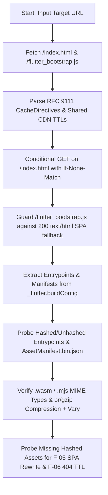

# Flutter Web Cache Check (`flutter_web_cache_check`) Design Document

## 1. Overview & Two-Layer Architecture

`flutter_web_cache_check` is a Dart CLI and library designed to audit and
configure HTTP caching for Flutter Web applications compiled with
`--web-content-hash` (`flutter/flutter#190153`).

The tool is structured around a **two-layer architecture**:

1. **Layer 1 — Universal HTTP & Flutter Web Runtime Checks (`UrlChecker`)**:
   Host-agnostic RFC 9111 `Cache-Control` parsing (`CacheDirectives`), shared
   CDN TTL precedence (`CDN-Cache-Control` -> `Surrogate-Control` -> `s-maxage`
   -> `max-age`), hashed vs. unhashed asset graph verification, `.wasm`/`.mjs`
   MIME enforcement, Brotli/Gzip compression and `Vary: Accept-Encoding`
   validation, conditional `304 Not Modified` revalidation, SPA catch-all
   rewrite poisoning probes, and `404` negative-cache TTL probes.
2. **Layer 2 — Firebase Hosting Adapter (`HostPlatform.firebase` &
   `fb-config`)**:
   Auto-detects Firebase Hosting via `Vary: x-fh-requested-host`, warns when
   `no-cache`/`no-store`/`private` triggers Fastly VCL `return(pass)` (`F-12`),
   and configures `firebase.json` with a 5-rule `last-match-wins` header stack
   and guarded SPA rewrites.

---

## 2. Subcommand: `fb-config` (Firebase Hosting Adapter)

### 2.1 Objective

Automatically inject, migrate, and guard caching headers, SPA rewrites, and
predeploy build flags inside `firebase.json` so that:

- Fastly CDN edges cache `index.html` and `flutter_bootstrap.js` with `s-maxage`
  / `max-age=0, must-revalidate` (enabling edge `304 Not Modified` revalidation
  instead of bypassing Fastly via `return(pass)`).
- Firebase Hosting's implicit `max-age=3600` fallback is overridden for all
  unhashed files (`**`) and `404.html`.
- Content-hashed entrypoints (`main.dart.*.{js,wasm,mjs}`) and hashed assets
  under `assets/**` receive `public, max-age=31536000, immutable`.
- Unhashed manifest files under `assets/` (`AssetManifest.bin.json`,
  `FontManifest.json`, `NOTICES`, etc.) override `assets/**` back to
  `max-age=0, must-revalidate`.

### 2.2 Canonical 5-Rule `last-match-wins` Header Stack (`firebase.json`)

Firebase Hosting evaluates `hosting.headers` in declaration order where **the
last matching rule wins** for any duplicate header key (`Cache-Control`).
`fb-config` writes the following 5-rule ordered stack:

| Order | Glob `source` | `Cache-Control` Value | Rationale |
| :--- | :--- | :--- | :--- |
| 1 | `**` | `max-age=0, must-revalidate` | Overrides Firebase's 3600s default on `index.html`, `flutter_bootstrap.js`, `version.json`, and deferred `.part.js` chunks while keeping Fastly edge 304s active. |
| 2 | `**/main.dart.*.{js,wasm,mjs}` | `public, max-age=31536000, immutable` | Caches content-hashed Dart2JS / Dart2Wasm bundles for 1 year without reload revalidation. |
| 3 | `assets/**` | `public, max-age=31536000, immutable` | Caches hashed asset files under `assets/` for 1 year. |
| 4 | `assets/@(AssetManifest.json\|AssetManifest.bin\|AssetManifest.bin.json\|FontManifest.json\|NOTICES)` | `max-age=0, must-revalidate` | Overrides Rule 3 (`assets/**`) so unhashed Flutter manifest files revalidate on every deploy. |
| 5 | `404.html` | `max-age=0, must-revalidate` | Prevents CDN edges or browsers from caching `404 Not Found` responses during non-atomic deploy rollouts. |

### 2.3 Guarded SPA Rewrite (`!/@(assets|canvaskit|icons|main.dart.*)/**`)

An unguarded SPA catch-all rewrite
(`"source": "**", "destination": "/index.html"`) causes missing hashed bundles
or assets to return `200 OK` with `text/html` (`index.html`) instead of
`404 Not Found`, poisoning immutable caches (`F-05`).

When `fb-config` encounters a rewrite with `"source": "**"` or `"**/*"`
targeting `/index.html`, it automatically rewrites `"source"` to:

```json
{
  "source": "!/@(assets|canvaskit|icons|main.dart.*)/**",
  "destination": "/index.html"
}
```

### 2.4 Legacy Rule Migration & Predeploy Automation

- **Legacy Migration**: Any legacy v0.1.0 header rules (such as
  `**/{index.html,flutter_bootstrap.js,...}` with `no-cache, no-store`) are
  replaced in-place by the canonical 5-rule stack while preserving user-defined
  custom headers (e.g. `Cross-Origin-Opener-Policy`,
  `Access-Control-Allow-Origin`).
- **Predeploy Hook (`--add-predeploy`)**: Ensures
  `"flutter build web --web-content-hash"` is configured in `hosting.predeploy`.

---

## 3. Subcommand: `check` (Universal & Platform-Aware Auditor)

### 3.1 Audit Workflow



### 3.2 Rule Catalog (`CheckFinding` IDs)

| Rule ID | Category | Severity | Verification Condition |
| :--- | :--- | :--- | :--- |
| `F-01` | Root HTML (`index.html` / `/`) | `fail` / `ok` | Browser `max-age <= 0` (or `no-cache`/`no-store`), not `immutable`, and shared CDN TTL (`CDN-Cache-Control` / `Surrogate-Control` / `s-maxage`) `<= 0`. |
| `F-02` | Bootloader (`flutter_bootstrap.js`) | `fail` / `ok` | Must revalidate (`max-age=0, must-revalidate` or `no-cache`) with shared CDN TTL `<= 0`. |
| `F-03` | App Bundles (`mainJsPath`, `mainWasmPath`, `jsSupportRuntimePath`) | `fail` / `warn` / `ok` | Hashed bundles require `max-age >= 31536000`, `immutable`, and not `private`/`no-cache`/`no-store` (`warn` if missing `immutable`). Unhashed bundles must revalidate (`max-age <= 0`). |
| `F-04` | Hashed Manifests (`assetManifest`, `fontManifest`) | `fail` / `warn` / `ok` | When `buildConfig` specifies content-hashed manifest paths, enforces `max-age >= 31536000, immutable`. |
| `F-05` | SPA Catch-All Rewrite Poisoning | `fail` / `ok` | Probes `/main.dart.00000000.js` and `/assets/__cache_check_missing__.00000000.png` (plus guards `/flutter_bootstrap.js` and manifest probes). Fails if any static asset probe returns `200 OK` or `text/html`. |
| `F-06` | Negative-Cache (`404`) TTL | `fail` / `warn` / `ok` | Inspects `404` responses on missing hashed paths. Fails if `immutable` or effective TTL `> 60s`; warns if `0 < TTL <= 60s`. |
| `F-07` | Unhashed Manifests (`assets/AssetManifest.bin.json`) | `fail` / `ok` | Probes `assets/AssetManifest.bin.json` when unhashed and fails if `max-age > 0` or missing explicit revalidation. |
| `F-12` | Firebase Fastly `return(pass)` | `warn` | Emitted when `HostPlatform.firebase` is detected (`Vary: x-fh-requested-host`) and root/bootloader uses `no-cache`, `no-store`, or `private` instead of `max-age=0, must-revalidate`. |
| `M-01` | WebAssembly MIME Type | `fail` / `ok` | `.wasm` responses must carry `Content-Type: application/wasm` (required by `WebAssembly.instantiateStreaming`). |
| `M-02` | JavaScript Module MIME Type | `fail` / `ok` | `.mjs` and `.js` responses must carry `text/javascript` or `application/javascript`. |
| `C-01` | Payload Compression | `warn` / `ok` | Payloads exceeding `minCompressionBytes` (`1024` bytes) should be compressed with `br`, `gzip`, or `zstd`. |
| `C-02` | Compression Cache Key (`Vary`) | `warn` | Compressed payloads must include `Vary: Accept-Encoding` so shared caches do not serve mismatched encodings. |
| `R-01` | Revalidation Validators | `warn` | `index.html` should provide `ETag` or `Last-Modified` headers for conditional requests. |
| `R-02` | Conditional `304 Not Modified` | `warn` / `ok` | Sends follow-up `GET` with `If-None-Match: <etag>` and verifies `304 Not Modified` (warns if origin returns `200 OK`). |

---

## 4. Technical Architecture & Packaging

- **Language & Entrypoints**: Dart CLI (`bin/flutter_web_cache_check.dart`) and
  programmatic library (`lib/flutter_web_cache_check.dart`).
- **Command Routing**: `package:args/command_runner.dart` implementing
  `FbConfigCommand` and `CheckCommand` (`--platform auto|firebase|generic`).
- **HTTP Client**: Injectable `package:http` `Client` on `UrlChecker` for
  deterministic unit testing (`MockClient`) and live remote auditing.
