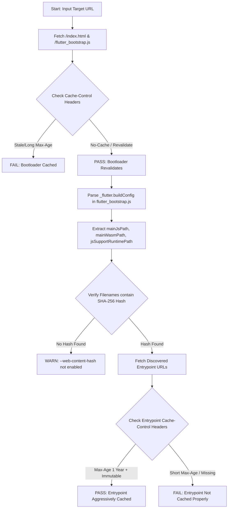

# Flutter Web Cache Check (`flutter_web_cache_check`) Design Document

## 1. Overview
`flutter_web_cache_check` is a specialized Dart CLI tool designed to solve web caching challenges for Flutter web applications, specifically aligning with the `--web-content-hash` compiler option introduced in `flutter/flutter#190153`.

The tool serves two core purposes:
1. **Configure (`fb-config`)**: Automated modification and auditing of Firebase Hosting configuration files (`firebase.json`) to ensure long-term caching of immutable hashed entrypoints, zero-caching of bootloader manifests, and automated predeploy compilation.
2. **Verify (`check`)**: Live remote verification of hosted Flutter web applications to validate that HTTP response headers and bootstrap configurations match expected caching behavior.

---

## 2. Subcommand: `fb-config`

### 2.1 Objective
Automatically inject or audit caching header rules and build scripts in an existing Flutter web project's Firebase Hosting configuration (`firebase.json`), ensuring optimal cache hit ratios without serving stale application logic.

### 2.2 Target Rules (`firebase.json` Specification)
When targeting Firebase Hosting, the `fb-config` command modifies the `hosting.headers` and `hosting.predeploy` sections inside `firebase.json`.

#### Rule 1: Immutable Hashed Entrypoints
Compiled binaries generated with `--web-content-hash` contain an 8-character SHA-256 digest in their filename (e.g., `main.dart.10579154.js`). These files are immutable and must be cached aggressively.
* **Glob Matcher**: `"**/main.dart.*.{js,wasm,mjs}"`
* **Injected Header**:
  * `Key`: `Cache-Control`
  * `Value`: `public, max-age=31536000, immutable`

#### Rule 2: Un-hashed Bootloaders, Manifests, & Deferred Modules
Bootloader files, metadata manifests, and deferred loading part files do not include content hashes in their filenames in Option 1 (Core MVP). Because of current limitations, deferred JS/WASM part files (`*.part.js`, `*.part.wasm`, `_module*.wasm`) lack content hashes and therefore **must not be cached long-term**. All un-hashed files must be revalidated on every request so browsers immediately discover new application deployments without stale chunk crashes.
* **Glob Matchers**:
  * `"**/{index.html,flutter_bootstrap.js,flutter.js,flutter_service_worker.js,manifest.json,version.json}"`
  * `"**/*.part.{js,wasm}"`
  * `"**/_module*.wasm"`
* **Injected Header**:
  * `Key`: `Cache-Control`
  * `Value`: `no-cache, no-store, must-revalidate`

#### Rule 3: Build / Predeploy Command Automation (Optional)
When invoked with `--add-predeploy` (or by default when configuring hosting), `fb-config` inspects and wires up the `predeploy` array under `hosting` in `firebase.json` to ensure automated compilation with content hashing prior to deployment.
* **Target Rule**: Ensures `"flutter build web --web-content-hash"` is present in the `predeploy` array.
* **Smart Update**: If an existing `"flutter build web"` command is found without the flag, it is automatically appended with `--web-content-hash`. If no web build command exists, `"flutter build web --web-content-hash"` is added to the array.

### 2.3 Execution Behavior
* Reads local `firebase.json` in the working directory (or path provided via `--file`).
* If `hosting` or `hosting.headers` does not exist, scaffolds the appropriate JSON array.
* Merges caching rules without overwriting or destroying unrelated user configurations (e.g., custom rewrites, clean URLs, or CORS headers).
* Optionally updates `hosting.predeploy` to include `--web-content-hash` when requested via `--add-predeploy`.
* Outputs a summary of added or modified rules to standard output.

---

## 3. Subcommand: `check`

### 3.1 Objective
Perform an end-to-end HTTP audit against a live deployed web URL (e.g., `https://my-app.web.app` or `http://localhost:5000`) to confirm that caching headers are functioning correctly on the live infrastructure.

### 3.2 Audit Workflow

### 3.3 Detailed Verification Steps
1. **Bootloader Header Inspection**:
   * Issues `GET` or `HEAD` requests to `/index.html` and `/flutter_bootstrap.js`.
   * Asserts that `Cache-Control` specifies `no-cache`, `no-store`, `max-age=0`, or `must-revalidate`.
2. **Manifest Parsing**:
   * Reads the body of `/flutter_bootstrap.js`.
   * Extracts the `_flutter.buildConfig` JSON object.
   * Identifies active compilation targets and their corresponding filenames (`mainJsPath`, `mainWasmPath`, `jsSupportRuntimePath`).
3. **Hash Verification**:
   * Validates that extracted filenames match the regex pattern `r'^main\.dart\.[a-f0-9]{8}\.(js|wasm|mjs)$'`.
4. **Immutable Asset Header Inspection**:
   * Issues `HEAD` requests to the discovered entrypoint URLs (e.g., `/main.dart.10579154.js`).
   * Asserts that `Cache-Control` contains `max-age=31536000` (or similar long duration) and `immutable`.
5. **Deferred Module Header Inspection**:
   * Probes or inspects discovered deferred loading part files (e.g., `main.dart.js_1.part.js`, `_module1.wasm`).
   * Verifies that they are served with `no-cache`, `no-store`, `max-age=0`, or `must-revalidate`, confirming they are not cached long-term due to current Phase 1 limitations.

### 3.4 Diagnostic Report Output
Prints a clear tabular or bulleted CLI report:
* ✅ `[PASS]` `/flutter_bootstrap.js` -> `Cache-Control: no-cache`
* ✅ `[PASS]` Entrypoint hash detected: `main.dart.10579154.js`
* ✅ `[PASS]` `/main.dart.10579154.js` -> `Cache-Control: public, max-age=31536000, immutable`
* ✅ `[PASS]` Deferred part `/main.dart.js_1.part.js` -> `Cache-Control: no-cache`
* ❌ `[FAIL]` (if any headers violate revalidation or immutability rules, explaining the exact risk to the user).

---

## 4. Technical Architecture & Packaging
* **Language**: Dart (CLI application structure following `dart-build-cli-app` guidelines).
* **Command Routing**: `package:args/command_runner.dart` implementing `FbConfigCommand` and `CheckCommand`.
* **HTTP Client**: `package:http` for remote header and script fetching.
* **Error Handling**: `package:stack_trace` with terse error formatting and POSIX exit codes (`exit(0)` on check pass, `exit(1)` on check failure or configuration error, `exit(64)` on CLI usage error).
